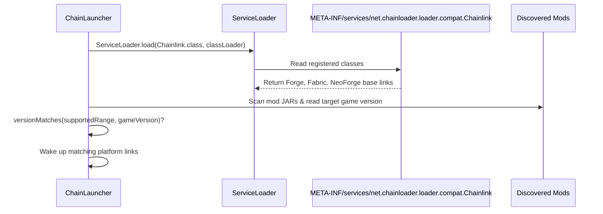

# Chainlinks & Subloaders

ChainLoader uses a modular architecture where compatibility layers and version-specific translation routines are isolated into modules called **Chainlinks** and managed by **Subloaders**. This page explains how the loading system boots and dynamically registers these modules.

---

## 1. The Chainlink Interface (`Chainlink`)
The core contract for compatibility modules is the `net.chainloader.loader.compat.Chainlink` interface. Every Chainlink module provides:
* **Target Version Support**: Indicates the Minecraft version range supported (e.g., `[1.20, 1.20.1]`) via `getSupportedVersionRange()`.
* **Loader Target**: Indicates the target platform (e.g., `fabric`, `forge`, `neoforge`) via `getSupportedLoaderType()`.
* **Lifecycle wakeup Hook**: `onWakeUp(ClassLoader)` is executed when the module is activated.
* **Remapping Rules**: Version-and-loader-specific remappings for classes, methods, and fields via `mapMethod`, `mapField`, and `mapClass`.
* **Instruction Transforms**: Direct class file transformations via `transform(String, byte[])` for custom ASM instrumentation.
* **Marker Fields**: Tells the core loader's fast-path remapper what string constants or package markers in class constant pools to look out for (`getRemapTargetMarkers()`).

---

## 1.1 Core Design Philosophy: Library Shimming
A primary purpose of the Chainlink system is to register and translate shared libraries (such as Architectury API, Balm, or common utility frameworks). By packaging library-level shims inside Chainlinks, mod developers do not have to write or rewrite modloader-specific integration code for each version update of their libraries.

Instead, they write code against a single library API, and the loader-side Chainlink automatically maps classes, translates events, and injects redirects under the hood to ensure full compatibility.

---

## 2. SPI Discovery and Dynamic Activation
ChainLoader utilizes Java's standard **Service Provider Interface (SPI)** mechanism to locate and boot Chainlinks.



During the bootstrap phase:
1. **SPI Scanning**: `ChainLauncher` queries `ServiceLoader.load(Chainlink.class, classLoader)` which reads implementation registries listed in `META-INF/services/net.chainloader.loader.compat.Chainlink` across the classpath.
2. **Version Checking**: The loader detects the current Minecraft runtime version (using system properties or looking up standard assets).
3. **Activation**: If a Chainlink module matches the target version range and loader type of any discovered mod, the loader triggers `onWakeUp(classLoader)` and adds it to the active translation registry.

---

## 3. Dynamic Backwards Compatibility Adapters
To support older mod binaries compiled against legacy versions (e.g. 1.16, 1.18, 1.20), the primary platform Chainlinks (such as `Chainlink1_21_1_Fabric`) dynamically register sub-adapters at runtime.

When `Chainlink1_21_1_Fabric` boots:
1. It queries the list of discovered mods found by the `ModScanner`.
2. It extracts their target Minecraft version requirements.
3. For each target version, it checks if a corresponding version-specific adapter matches:
   ```java
   tryLoadAdapter("[1.20, 1.20.1]", "net.chainloader.loader.compat.Chainlink1_20_1_Fabric", targetVersions, classLoader, instantiatedClasses);
   ```
4. If a match is found, the sub-adapter is reflectively instantiated and registered into the global active translation pipeline. This modularity prevents 1.19-specific translation rules from running and colliding with 1.20-specific rules on a clean 1.21.1 game instance.

---

## 4. Subloaders and Classloader Isolation
To allow mods compiled for different platforms (like Fabric and Forge) to run in the same class loader context without class definition conflicts, ChainLoader implements subloading adapters:
* **KnotClassLoaderAdapter**: Emulates the Fabric Knot environment, ensuring that Fabric mods searching for Fabric Loader classes (e.g. entrypoint setups) find them successfully.
* **UnifiedDependencyResolver**: Resolves dependencies transitively for both Forge and Fabric mods, performing a topological sort (DFS) to determine the exact order in which mod classes should be loaded.
* **Stubs and Self-Loaded Packages**: Subloader modules specify packages that must bypass parent delegation (via `getSelfLoadedPackages()`) so that they are loaded directly inside the custom `ChainClassLoader`, preventing class leakage from the system class loader.
