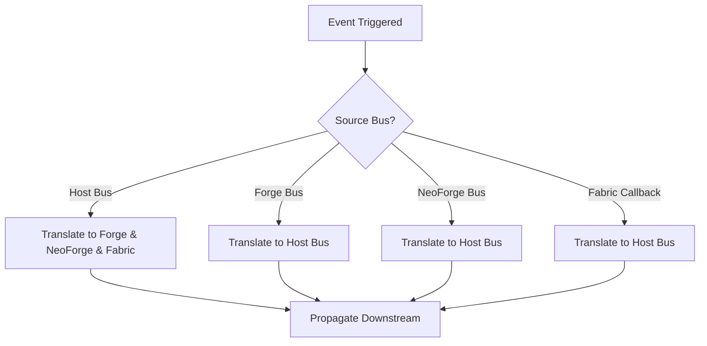

# Events

ChainLoader bridges legacy mods by translating and propagating events across three event systems: ChainLoader's native host event bus, Forge's event bus, and NeoForge's event bus. This bi-directional bridging is managed by `EventTranslatorBus` and `ForgeEventTranslator`.

---

## 1. Bi-Directional Event Bus Architecture (`EventTranslatorBus`)

The `net.chainloader.loader.compat.bridge.EventTranslatorBus` connects the event systems at runtime. It registers event listeners on each bus and maps objects and status states from one platform's event descriptor to another.



### 1.1 Initialization
The bus is initialized with references to the respective platform event buses during loader startup:
```java
EventTranslatorBus.getInstance().init(hostBus, forgeBus, neoforgeBus);
```

### 1.2 ThreadLocal Loop Prevention
Because translations are bi-directional (e.g., Host to Forge and Forge to Host), a naïve dispatch loop would recursively post events until a `StackOverflowError` occurs. 

To prevent this, `EventTranslatorBus` utilizes a ThreadLocal set:
```java
private final ThreadLocal<Set<Object>> activeTranslationEvents = ThreadLocal.withInitial(HashSet::new);
```
Before translating an event, its reference is added to `activeTranslationEvents`. If the translator intercepts a subsequent event that matches an active token, it aborts the translation immediately.

---

## 2. Event Translation Mappings

Several critical block, level, server, and tooltip events are translated:

### 2.1 Block Break Event (`BlockBreakEvent`)
* **Host**: `net.chainloader.api.event.BlockBreakEvent`
* **Forge**: `net.minecraftforge.event.level.BlockEvent.BreakEvent`
* **NeoForge**: `net.neoforged.neoforge.event.level.BlockEvent.BreakEvent`
* **Fabric Callback**: `PlayerBlockBreakCallback`
* **State Synchronization**:
  - Translates level, block position, block state, player instance, and experience dropped (`xpToDrop`).
  - Correctly propagates the `canceled` status across all platforms (e.g. if a Fabric listener cancels the block break, the NeoForge event is canceled as well).

### 2.2 Server Lifecycle Events
Server startup and shutdown events are bridged to coordinate background tasks:
* **Starting**: `ServerStartingEvent` -> Forge/NeoForge `ServerStartingEvent`
* **Started**: `ServerStartedEvent` -> Forge/NeoForge `ServerStartedEvent`
* **Stopping**: `ServerStoppingEvent` -> Forge/NeoForge `ServerStoppingEvent`
* **Stopped**: `ServerStoppedEvent` -> Forge/NeoForge `ServerStoppedEvent`

### 2.3 Level Lifecycle Events
World loading, saving, and unloading events are bridged:
* `LevelLoadEvent` -> Forge/NeoForge `LevelEvent.Load`
* `LevelUnloadEvent` -> Forge/NeoForge `LevelEvent.Unload`
* `LevelSaveEvent` -> Forge/NeoForge `LevelEvent.Save` (and triggers Fabric's `ServerLevelEvents.SAVE`).

### 2.4 Tooltip Event (`ItemTooltipEvent`)
Enables mods on all loaders to append custom text components to item stacks:
* `ItemTooltipEvent` -> Forge/NeoForge `ItemTooltipEvent`.

---

## 3. Dedicated Event Translation Shims (`ForgeEventTranslator`)

For standalone event systems (e.g. where Forge classes are emulated), `net.chainloader.loader.compat.forge.ForgeEventTranslator` coordinates bridges:
```java
public void registerBridges() {
    // 1. Host Event -> Forge Event bridge
    hostBus.register(BlockBreakEvent.class, this::translateHostToForgeBlockBreak);

    // 2. Forge Event -> Host Event bridge
    forgeBus.addListener(BlockEvent.BreakEvent.class, this::translateForgeToHostBlockBreak);
}
```
Through these shims, legacy Forge listeners registered via the `@SubscribeEvent` annotation continue to receive notifications when blocks are broken, servers start, or players tick.

---

## 4. Tick, Player, and Screen Events

To resolve compatibility issues with JEI, Nature's Compass, and Waystones, we added deep event-bridging hooks into the Minecraft client and server runtime:

### 4.1 Client Tick Event (`ClientTickEvent`)
- **Host Hook**: Injected into `Minecraft.runTick` (`bp`) at the start and end of the loop.
- **NeoForge**: Dispatches `ClientTickEvent.Pre` and `ClientTickEvent.Post` to `NeoForge.EVENT_BUS`.
- **Forge**: Dispatches `TickEvent.ClientTickEvent` (with phases `START` and `END`).
- **Fabric**: Triggers `ClientTickEvents.START_CLIENT_TICK` and `ClientTickEvents.END_CLIENT_TICK`.

### 4.2 Server Tick Event (`ServerTickEvent`)
- **Host Hook**: Injected into `MinecraftServer.tickChildren` (`c`) at the start and end.
- **NeoForge**: Dispatches `ServerTickEvent.Pre` and `ServerTickEvent.Post` to `NeoForge.EVENT_BUS`.
- **Forge**: Dispatches `TickEvent.ServerTickEvent` (with phases `START` and `END`).

### 4.3 Container Screen Rendering (`ContainerScreenEvent`)
- **Host Hook**: Injected into `AbstractContainerScreen.renderLabels` (`b`) at the end of the method.
- **NeoForge**: Dispatches `ContainerScreenEvent.Render.Foreground` to `NeoForge.EVENT_BUS`. This enables JEI to draw its overlay elements (such as item recipes and lists) on the inventory screen.

### 4.4 Screen Opening Event (`ScreenEvent.Opening`)
- **Host Hook**: Injected into `Minecraft.setScreen` (`a`).
- **NeoForge**: Dispatches `ScreenEvent.Opening` to `NeoForge.EVENT_BUS`, allowing listeners to replace or cancel screens before display.

### 4.5 Player Login & Logout Events
- **Host Hook**: Injected into `PlayerList.placeConnection` (`a`) for joins, and `PlayerList.remove` (`b`) for disconnects.
- **NeoForge/Forge**: Dispatches `PlayerEvent.PlayerLoggedInEvent` and `PlayerEvent.PlayerLoggedOutEvent`.

---

## 5. Architectury Events Bridging

Shadowed Architectury event classes in Forge/Fabric legacy mods register listeners to empty stubs. We redirected these stubs to dynamically collect listeners at runtime:

- **HUD Rendering**: `ClientGuiEvent.RENDER_HUD` collects renderers and executes them during client ticks.
- **Client Ticks**: `ClientTickEvent.CLIENT_POST` collects post-tick callbacks.
- **Client Player Lifecycle**: `ClientPlayerEvent.CLIENT_PLAYER_JOIN` / `CLIENT_PLAYER_QUIT` tracks when `LocalPlayer` joins or leaves a server.
- **Server Player Lifecycle**: `PlayerEvent.PLAYER_JOIN` / `PLAYER_QUIT` tracks server-side joins/disconnects.

