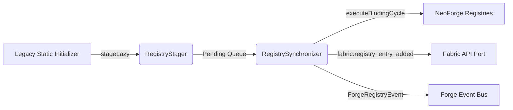

# Registries

Minecraft 1.21.1 (NeoForge) uses dynamic, frozen, and data-driven registry structures. Legacy mods (1.19/1.20) often perform static block and item registrations during early classloading phases. This architectural mismatch can cause JVM verification issues, early classloading, or crashes due to frozen registries. 

To bridge this gap, ChainLoader uses a lazy, staged synchronization mechanism comprised of `ChainRegistryBridge`, `RegistryStager`, and `RegistrySynchronizer`.

---

## 1. Core Architecture and Staging

Registry allocation is divided into two distinct phases: **Staging** (early boot, static initialization) and **Binding** (late boot, active registry event handling).



### 1.1 Staged Registry Entries
During early initialization, legacy mods call registration methods (e.g. `Registry.register` on Fabric or `RegisterEvent` on Forge). ChainLoader intercepts these calls and stages them inside `net.chainloader.loader.compat.registry.RegistryStager`:
* Staged entries are encapsulated inside `StagedEntry<T>` containing:
  - `entryId`: Resource location string (e.g. `legacy_mod:ruby_ore`).
  - `valueSupplier`: A lazy `Supplier<T>` that defers object instantiation until the binding phase.
* Legacy helper mappings exist for quick staging:
  ```java
  RegistryStager.registerLegacyBlock("legacy_mod", "ruby_ore", () -> new Block(...));
  RegistryStager.registerLegacyItem("legacy_mod", "ruby", () -> new Item(...));
  ```

### 1.2 The Pending Queue (`ChainRegistryBridge`)
For other registry types, `ChainRegistryBridge` collects entries into a global queue of `RegistryEntry` containing the registry identifier (e.g. `minecraft:mob_effect`), entry ID, and value.

---

## 2. Registry Synchronization (`RegistrySynchronizer`)

`net.chainloader.loader.compat.bridge.RegistrySynchronizer` is the central controller coordinating the staging-to-binding transition. It tracks the registry's lifecycle using the `LifecycleState` enum:
* `UNINITIALIZED`: The registry is dormant.
* `STAGING`: Early boot; legacy mod static initializers are running and staging entries.
* `BINDING`: The active NeoForge registration event has fired. Staged entries are retrieved and bound.
* `COMPLETED`: Staging queue is cleared, and entries are registered.
* `FROZEN`: Registry is locked by the game engine.

### 2.1 The Binding Cycle
When a NeoForge registry is ready for entries, the loader calls `executeBindingCycle(registryId)`:
1. Transitions the target registry state to `LifecycleState.BINDING`.
2. Queries `RegistryStager.getInstance().inject` to register entries with the native NeoForge registry binder.
3. **Fabric API Port Coordination**: For each bound entry, dispatches the `fabric:registry_entry_added` event via `FabricLoaderShim` so that Fabric API registry callbacks receive notifications.
4. **Forge Event Translation**: If any entries are bound, it posts a `ForgeRegistryEvent` containing the mapped objects on the compatibility event bus.
5. Transitions state to `LifecycleState.COMPLETED`, and finally `LifecycleState.FROZEN`.

---

## 3. Remapping Registry Names (`RegistryHelper`)

Legacy Forge mods rely on calling `setRegistryName` directly on registry objects. Because this method does not exist on modern Minecraft classes, ChainLoader provides bytecode-level redirects and a registry helper:

### 3.1 RegistryHelper API
`net.chainloader.loader.compat.bridge.RegistryHelper` maintains a `WeakHashMap<Object, ResourceLocation>` to store registry names for instanced blocks and items:
* `setRegistryName(Object, ResourceLocation)`: Binds a registry name to the target object.
* `getRegistryName(Object)`: Returns the resource location bound to the object.

### 3.2 Bytecode Injection
To support legacy invocation, the `BytecodeTransformer` dynamically injects `setRegistryName` methods into the bytecode of `Block`, `Item`, and `Fluid` classes during load-time:
```java
// Dynamically injected signature
public Block setRegistryName(ResourceLocation name) {
    return (Block) RegistryHelper.setRegistryName(this, name);
}
```
This injection prevents `NoSuchMethodError` crashes when legacy mods initialize their static fields.
