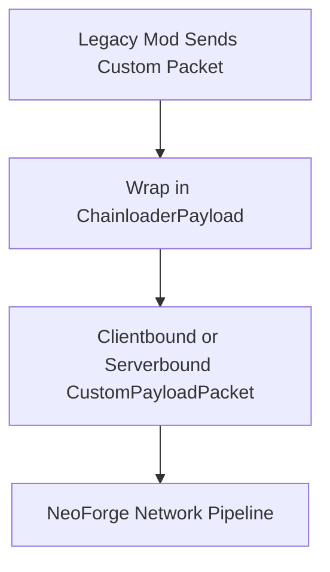

# Entity Data & Networking

Entity data synchronization and packet networking were heavily modified in Minecraft 1.21.1. NeoForge uses a typed Data Attachment system for storing arbitrary entity parameters, and network packets are routed through modern payload registration handlers. 

This document details how ChainLoader bridges entity data attachments, persistent NBT tags, and custom packet networking.

---

## 1. Entity Persistent NBT Shim (`getEntityPersistentData`)

Legacy Forge mods attach custom variables to entities by invoking `entity.getPersistentData()`, which returns a mutable `CompoundTag` associated with the entity instance. 

Since this method does not exist on modern entities, ChainLoader redirects these calls:

### 1.1 Bytecode Interception
`BytecodeTransformer` redirects calls to `getPersistentData` to:
`net.chainloader.loader.compat.bridge.EventBridgeHelper.getEntityPersistentData(Object)`

### 1.2 The Storage Bridge
`EventBridgeHelper` maintains a concurrent cache for this NBT data:
```java
private static final Map<Object, CompoundTag> entityPersistentData = new ConcurrentHashMap<>();
```
* **Read**: Returns the cached `CompoundTag` for the entity. If none exists, it instantiates an empty one.
* **Save/Load Hooking**: When the game writes the entity to NBT during level saves, the loader intercepts the serialization and injects this persistent NBT map into the entity's main NBT compound tag. When the entity is read, it parses the map back into the cache.

---

## 2. Custom Payload Packet Bridging

Legacy Fabric mods send custom packet bytes using `ClientPlayNetworking` or `ServerPlayNetworking`. ChainLoader bridges this network layer to NeoForge's custom payload registrar:



### 2.1 Dynamic Namespace Routing
Instead of registering all channels under a single hardcoded namespace, ChainLoader dynamically allocates channels:
1. For each registered channel identifier (e.g. `mymod:packet_a`), the loader calls `event.registrar(channelId.getNamespace())`.
2. This registers the payload stream codecs under the exact mod namespace, satisfying NeoForge's strict internal routing.

### 2.2 Deferred Registration
To prevent registration race conditions, ChainLoader defers packet payload configuration:
* **The Issue**: Fabric mod initializers populate packet receivers during startup, but `RegisterPayloadHandlersEvent` fires early in the boot sequence.
* **The Solution**: Registration is deferred from `initializeMods` to `onMinecraftInit`, ensuring all mod receivers have been populated before the codecs are finalized.

### 2.3 Dedicated Server Isolation
To ensure dedicated server builds do not crash when loading client-only classes (such as `Minecraft` or GUI packet listeners):
* Client-specific callbacks and packet listeners are isolated inside a static nested class: `ClientPayloadHandlerHelper`.
* This helper is only classloaded and called if `FMLEnvironment.dist.isClient()` returns true.
