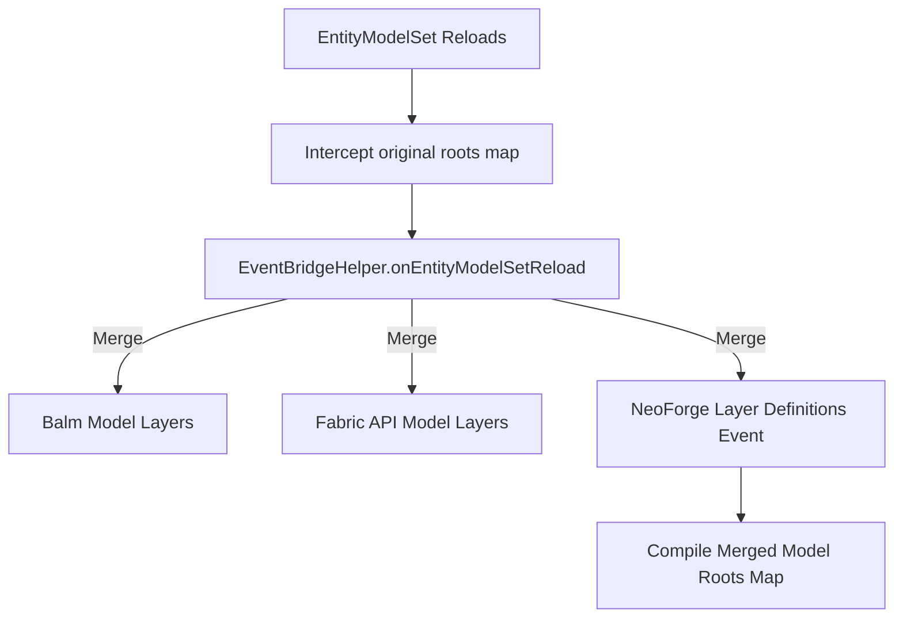

# Entity Renderers & Models

In Minecraft 1.21.1, registering entity renderers and defining custom models must occur during dedicated event cycles. Static registries that worked on legacy Fabric and Forge will fail on NeoForge. 

This document details how ChainLoader registers entity renderers and handles model reloading using the `EntityRenderersEvent` and `EntityModelSet` translation layers.

---

## 1. Custom Entity Renderer Registration

In legacy Fabric and Forge, renderers were registered using the static `EntityRenderers.register` method during client initialization:
```java
// Legacy Mod Client Init
EntityRenderers.register(EntityType.COW, CowRenderer::new);
```
In NeoForge 1.21.1, renderers must be registered during the `EntityRenderersEvent.RegisterRenderers` event.

### 1.1 Bytecode Interception & Visibility Wideners
1. **Public Visibility**: The classloader applies `transformEntityRenderers` to `net.minecraft.client.renderer.entity.EntityRenderers` (`bsx`). This transformation widens the access modifier of the registration method `a` (or `register`) to `public` to prevent runtime access errors.
2. **Registration Interception**: When a legacy mod calls `EntityRenderers.register(...)`, ChainLoader redirects the parameters to a local mapping queue.

### 1.2 Event Posting Lifecycle
During client initialization, ChainLoader listens to mod event buses and posts setup events:
```java
// Posting event to mod buses
net.neoforged.neoforge.client.event.EntityRenderersEvent.RegisterRenderers event = new EntityRenderersEvent.RegisterRenderers();
postToBus(bus, event);
```
1. **Collector**: The event gathers all custom renderers declared by NeoForge mods.
2. **Reflection Binder**: After the event finishes, ChainLoader iterates over the registered renderers map and registers them with the game engine by invoking the native `EntityRenderers.register(...)` method using reflection.

---

## 2. Model Layers & EntityModelSet Reloading

In Minecraft 1.21.1, entity models are defined by registering custom `ModelLayerLocation` and `LayerDefinition` parameters. When the resource manager reloads, the game recompiles these layers.

### 2.1 Reload Interception (`transformEntityModelSet`)
`BytecodeTransformer` modifies the `EntityModelSet` class (`aue`):
* **Target**: Method `a` (which builds the model roots map).
* **Redirect**: Intercepts the return value of `fyh.a()` (which queries active roots) and routes it to `EventBridgeHelper.onEntityModelSetReload(Map)`.

### 2.2 Merging Model Layers (`onEntityModelSetReload`)
The bridge method merges model definitions from multiple loaders:
1. **Balm Models**: Invokes `FabricModelLayers.createRoots()` using reflection to merge Balm-registered model layers.
2. **Fabric API Models**: Invokes `EntityModelLayerRegistry.createRoots()` to gather general Fabric-registered model layers.
3. **NeoForge Models**: Iterates over `customLayerDefinitions` (captured during the `EntityRenderersEvent.RegisterLayerDefinitions` event) and merges them.


By compiling and returning this merged map, custom entity textures and models load correctly on both Fabric and Forge mods.
