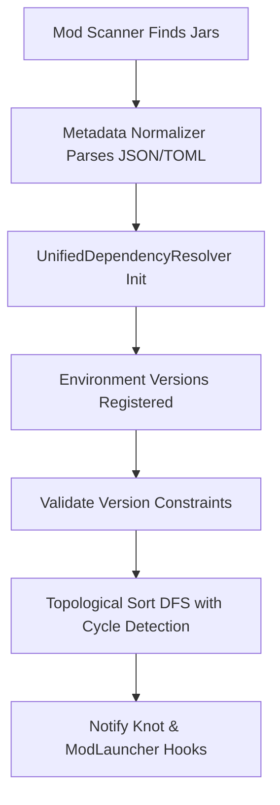

# Structuring Your Mod

ChainLoader is designed to load and bridge legacy Fabric, Forge, and NeoForge mod jars at runtime. Because these platforms have historically structured their metadata and dependency graphs differently, this document describes the physical structure that ChainLoader discovers, how it normalizes directories, and the inner workings of the `UnifiedDependencyResolver`.

## 1. Physical Layout and Discovery

ChainLoader's discovery engine, orchestrated by `net.chainloader.loader.core.ModScanner`, scans the configured Minecraft `mods/` directory for `.jar` files. It recursively reads each zip/jar file to determine its platform source.

### 1.1 Fabric Jar Layout
A standard Fabric mod jar is recognized by the presence of a `fabric.mod.json` descriptor in the root directory of the jar:
```text
mymod-fabric.jar
├── fabric.mod.json               # Fabric metadata and entrypoints
├── mymod.mixins.json             # Mixin configuration
├── assets/
│   └── mymod/                    # Textures, models, and lang files
├── data/
│   └── mymod/                    # Recipes, loot tables, advancements
└── com/mymod/
    └── ModClasses.class          # Mod binaries
```

### 1.2 Forge & NeoForge Jar Layout
A legacy Forge or NeoForge mod jar is recognized by the presence of a `mods.toml` descriptor located inside the `META-INF/` directory:
```text
mymod-forge.jar
├── META-INF/
│   ├── mods.toml                 # Forge metadata and dependencies
│   └── MANIFEST.MF               # Manifest attributes (e.g. FMLModType)
├── mymod.mixins.json             # Mixin configuration
├── assets/
│   └── mymod/                    # Client resources
├── data/
│   └── mymod/                    # Server data resources
└── com/mymod/
    └── ModClasses.class          # Mod binaries
```

### 1.3 Virtual Asset and Resource Relocation
To bridge the resource-loading mechanisms of legacy mods to NeoForge 1.21.1:
* **Asset Relocation**: The classloader dynamically registers an `AssetPathRelocator` which maps legacy asset paths to their modern equivalents at runtime.
* **Virtual Resource Packs**: Mod scanner packages resources into a `VirtualAssetPack` and registers it directly with Minecraft's `PackRepository` to satisfy resource requests without requiring physical filesystem extraction.

---

## 2. Unified Dependency Resolver (`UnifiedDependencyResolver`)

Once the mod metadata is normalized into a unified descriptor (`ChainModMetadata`), ChainLoader's `UnifiedDependencyResolver` runs to resolve mod load orders, manage dependencies, and coordinate platform-specific loaders.



### 2.1 Boot-Time Environment Virtual Mods
Before evaluating mod-specific dependency graphs, the resolver registers system-level "virtual mods" to satisfy dependencies on JVM versions, API loaders, and game versions. The default environment overrides are:
* `minecraft`: Defaulting to `"1.19.2"` (or custom overridden game version)
* `java`: Matches `System.getProperty("java.version")` (typically `"17"` or `"21"`)
* `fabricloader`: Mapped to `"0.14.21"`
* `forge`: Mapped to `"41.0.0"`
* `neoforge`: Mapped to `"20.1.0"`
* `chainloader`: Mapped to `"1.0.0"`

Custom environment overrides can be registered programmatically using:
```java
resolver.withEnvironmentMod("minecraft", "1.21.1");
```

### 2.2 Topological Sorting & Cycle Detection
The resolver determines the load order using a Depth-First Search (DFS) topological sorting algorithm. It utilizes a state map (`0 = UNVISITED`, `1 = VISITING`, `2 = VISITED`) to keep track of nodes:
1. **Unvisited (0)**: Node is untouched.
2. **Visiting (1)**: Node is currently being traversed. If a dependency points back to a node in state `1`, a circular dependency cycle is detected.
3. **Visited (2)**: Node and all its dependencies have been fully resolved. The mod is appended to the load order.

The cyclic path is recorded in a human-readable format:
`mod-a -> mod-b -> mod-c -> mod-a`

### 2.3 Exception Management
If the resolver encounters resolution errors, it reports them inside the `ResolutionResult` object:
* `MissingDependencyException`: Thrown if a mandatory dependency (not flagged as `optional`) is missing from the classpath.
* `VersionMismatchException`: Thrown if a dependency exists but its version does not satisfy the SemVer or Maven range constraints.

### 2.4 Loader Adapter Hooks
Because Fabric and Forge mods expect their native boot pipelines, `UnifiedDependencyResolver` exposes adapter hook interfaces:
* `KnotAdapterHook`: Notifies the Knot classloader adapter of resolved Fabric mods, allowing Knot to configure its classloading classpath.
* `ModLauncherAdapterHook`: Notifies ModLauncher of resolved Forge/NeoForge mods to prepare launch plugins.

Developers can hook into these cycles using:
```java
resolver.registerKnotHook(result -> {
    // Perform custom Knot classloader adjustments
});
resolver.registerModLauncherHook(result -> {
    // Adjust ModLauncher plugin registries
});
```
