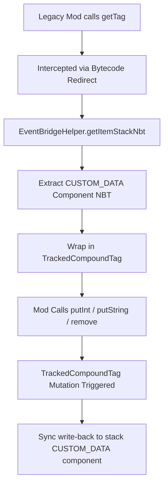

# Data Components & NBT Bridge

Minecraft 1.20.5+ replaced the legacy unstructured NBT tag (`CompoundTag`) system on item stacks with typed **Data Components**. Legacy mods that call `ItemStack.getTag()` or `ItemStack.getOrCreateTag()` fail on modern environments because the NBT tag map has been removed from `ItemStack`. 

To allow legacy mods to store and modify custom item data, ChainLoader implements a dynamic NBT-to-Component bridging mechanism using `TrackedCompoundTag`.

---

## 1. The TrackedCompoundTag Synchronization Loop

When a legacy mod queries an item's NBT tag, ChainLoader intercepts the call and returns an instance of `net.chainloader.loader.compat.bridge.EventBridgeHelper$TrackedCompoundTag`.



### 1.1 Mutation Interception
`TrackedCompoundTag` extends the native `CompoundTag` class and overrides all mutating operations, including:
* `put(String, Tag)`
* `putByte(String, byte)`, `putShort(String, short)`, `putInt(String, int)`, `putLong(String, long)`
* `putFloat(String, float)`, `putDouble(String, double)`
* `putString(String, String)`
* `putBoolean(String, boolean)`
* `putUUID(String, UUID)`
* `remove(String)`

### 1.2 The Write-Back Mechanism
After executing the super-class mutation, `TrackedCompoundTag` invokes its private `update()` method to force-synchronize the changes back to the stack's components:
```java
private void update() {
    stack.set(
        net.minecraft.core.component.DataComponents.CUSTOM_DATA, 
        net.minecraft.world.item.component.CustomData.of(this)
    );
}
```
This write-back ensures that any changes made to the legacy tag object are immediately encoded into Minecraft's modern Typed Data Components.

### 1.3 Placeholder Guard
To prevent the game from discarding empty NBT tags (which legacy mods sometimes check to verify NBT existence), ChainLoader ensures that when an NBT tag is empty, it is still serialized. During parsing, if the helper detects a compatibility-only NBT, it removes the placeholder key `"chainloader_nbt_compat"` before handing it to the mod.

---

## 2. Bytecode Redirect Mappings

`BytecodeTransformer` rewrites the bytecode of legacy classes to redirect legacy NBT method invocations to `EventBridgeHelper`:

| Target Method | Legacy Mapped Name | Redirected Helper Method |
| :--- | :--- | :--- |
| **Get NBT** | `m_41783_` (Mojang) / `method_7969` (Yarn) | `EventBridgeHelper.getItemStackNbt(Object)` |
| **Has NBT** | `m_41782_` (Mojang) / `method_7980` (Yarn) | `EventBridgeHelper.hasNbt(Object)` |
| **Get Sub-NBT** | `method_7947` (Yarn) | `EventBridgeHelper.getOrCreateSubNbt(Object, String)` |
| **Set NBT** | `m_41751_` (Mojang) | `EventBridgeHelper.setItemStackNbt(Object, Object)` |
| **From NBT (Static)** | `method_7915` (Yarn) | `EventBridgeHelper.fromNbt(Object)` |
| **Write NBT** | `method_7953` (Yarn) | `EventBridgeHelper.writeNbt(Object, Object)` |

---

## 3. Data Component Accessor Realignment

Minecraft 1.21.1 utilizes distinct methods for fetching and removing data components on item stacks:
* **Getter**: `ItemStack.get(DataComponentType)` (mapped to method `a` on `ItemStack`).
* **Remover**: `ItemStack.remove(DataComponentType)` (mapped to method `c` on `ItemStack`).

During earlier mappings inside `Chainlink1_21_1_Base`, these mappings were aligned to prevent type discrepancies:
1. Mapped the getter `get` explicitly to obfuscated method `a`.
2. Mapped the remover `remove` explicitly to obfuscated method `c`.

This alignment prevents legacy code from accidentally removing data components when they simply intend to retrieve them.
