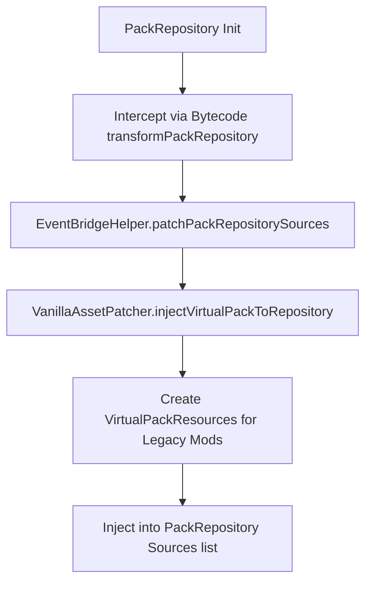

# Resource Metadata & Virtual Packs

Minecraft 1.21.1 checks resource pack and datapack formats. Outdated pack formats declared by legacy mods (e.g., format 15 in `pack.mcmeta`) cause the client to label them as "incompatible" and may prevent the server from loading datapack recipes, tags, or loot tables. 

This document describes how ChainLoader intercepts resource repository initialization, patches metadata descriptors, and injects virtual packs.

---

## 1. Virtual Pack Resource Injection (`transformPackRepository`)

To prevent the game from rejecting legacy mod asset folders, ChainLoader injects a virtual resource pack wrapper.



### 1.1 Bytecode Interception
`BytecodeTransformer` modifies the constructor of `PackRepository` (`atr`):
* **Target**: Constructor `<init>([Lnet/minecraft/server/packs/repository/RepositorySource;)V`
* **Redirect**: Intercepts the source array argument and routes it to:
  `net.chainloader.loader.compat.bridge.EventBridgeHelper.patchPackRepositorySources([Ljava/lang/Object;)[Ljava/lang/Object;`

### 1.2 Pack Injection
`EventBridgeHelper.patchPackRepositorySources` executes the injection:
1. Fetches the active repository instance.
2. Invokes `VanillaAssetPatcher.getInstance().injectVirtualPackToRepository(packRepository)` to compile a list of virtual packs for all loaded legacy mods.
3. Appends these sources to the repository sources list, ensuring they load alongside vanilla resource packs.

---

## 2. Pack Descriptor & Metadata Translation

Each virtual pack wraps a legacy mod's jar resources using `VirtualPackResources` (and `VirtualAssetPack`). The wrapper patches metadata descriptors dynamically:

### 2.1 Pack Format Translation
When the resource manager requests `pack.mcmeta`, the virtual resource reader intercepts the file stream and replaces the `"pack_format"` version:
* **Resource Packs (Client Assets)**: Replaces the format key with `"34"` (the format version required for Minecraft 1.21.1 client assets).
* **Data Packs (Server Data)**: Replaces the format key with `"48"` (the format version required for Minecraft 1.21.1 server datapacks).

```json
{
  "pack": {
    "description": "Virtual compatibility pack for legacy_mod",
    "pack_format": 34
  }
}
```

### 2.2 Namespace Mapping
Because resource files might reside under legacy asset namespaces, the virtual pack relocates paths internally (e.g., remapping `assets/minecraft/textures/gui/...` to the modern layout). This translation allows textures, lang keys, and block models to load correctly.
